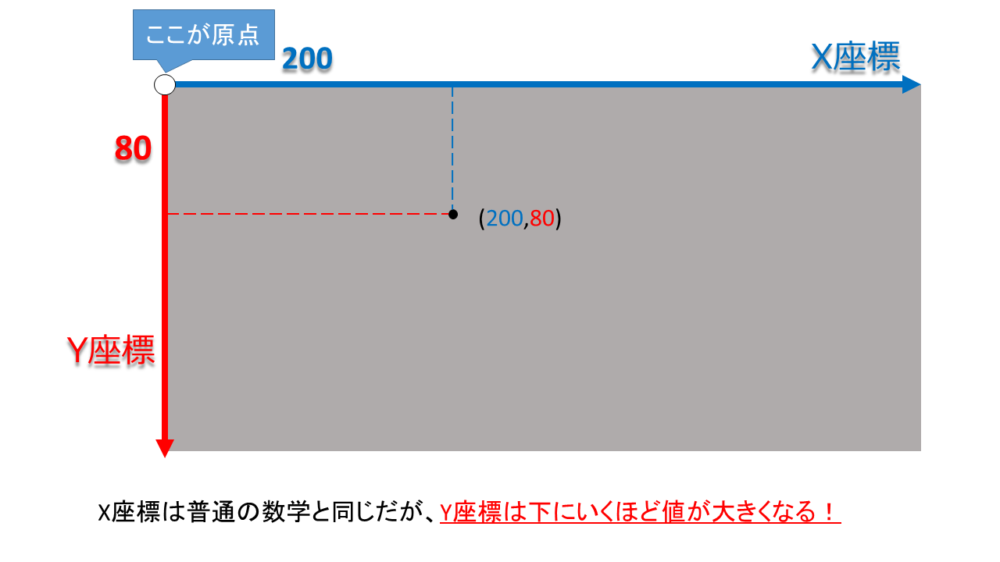
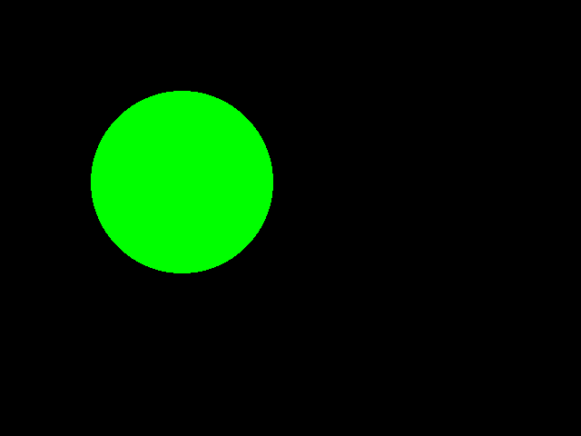
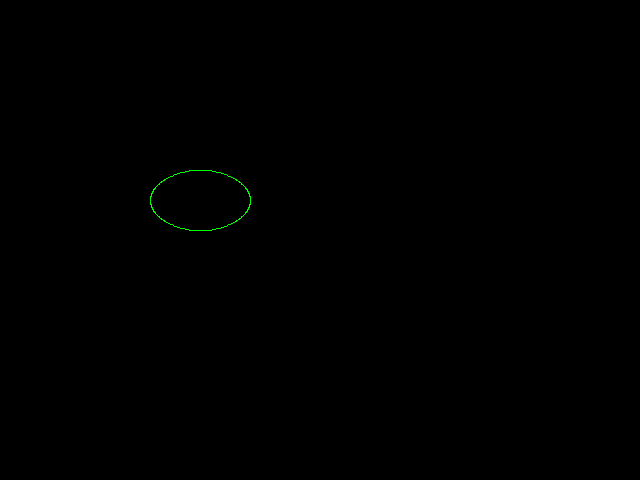

# Dxlibに描画する
Dxlibに描画してみましょう。例えば文字や図形、画像などを描画できます。

## その前に
一口に「描画する」といっても、どの位置に描画するのか分からないと描画できません。  
まだDxlibでの座標を何も触れてませんでしたのでここで触れたいと思います。  
簡単に表すと下の図のようになります。  
まず、原点が左上になってます。  
そして、縦がX座標、横がY座標です。ここはいいですが、**Y座標は下に行くほど正となっている**点に注意してください。   
数学の座標平面とは異なっていることを頭に入れておいてください。

 図：Dxlibにおける座標について   

この性質は今後ゲームを作る時、動きに関するバグが発生した際に真っ先に注意するべき点です。覚えておきましょう。(忘れてしまい、罠にはまることだけは避けましょう！！！！)
****
## 図形を描画する  
図形を描画するには、何色で描画するのかを決める必要があります。
### int GetColor(int Red , int Green , int Blue);
指定カラーから、カラーコードを取得できます。
カラーは、白が(Red:255,Green:255,Blue:255)、黒が(Red:0,Green:0,Blue:0)です。  
Red,Green,Blueはそれぞれの値です。(各値が大きいほど明るくなる、最大値は255)  
今回は、GetColorでRed:0,Green:255,Blue:0と設定して描画してみましょう。この色は赤成分0%、緑成分100%、青成分0%でとても緑です。(もちろん各自で変えてもらって結構です。)
***
### int DrawBox(int x1, int y1, int x2, int y2, int color,int FillFlag);
画面上に四角形を描きます。

|引数|説明|
|------|-----|
|(x1,y1)|描画する四角形の左上の座標|
|(x2,y2)|描画する四角形の右下+1の座標|
|color|GetColorで取得した四角形の色|
|FillFlag|四角形を塗りつぶすか  trueなら塗る、falseなら塗らない|

※trueはintの1と同じで、falseはintの0と同じ

戻り値は、0なら成功、-1ならエラーとなり描画できていません。
```C
//画面上に左上(100,100)、右上(300,300)の四角形を描く。
#include"DxLib.h"

int WINAPI WinMain(HINSTANCE,HINSTANCE,LPSTR,int){
    ChangeWindowMode(true);
	DxLib_Init();	// DXライブラリ初期化処理

    int color = GetColor(0,255,0) ;    // 緑色の値を取得
    DrawBox(100,100,300,300,color,true) ;    // 四角形を描画

	WaitKey();	// キー入力待ち
	DxLib_End();	// DXライブラリ終了処理
	return 0;
}
```
  
実行すると、(100,100)から(300,300)にかけて四角形が描画されています。
***
### int DrawCircle(int x, int y, int r, int color,int FillFlag);
画面上に円を描きます。

|引数|説明|
|------|-----|
|(x,y)|描画する円の中心の座標|
|r|描画する円の半径|
|color|GetColorで取得した四角形の色|
|FillFlag|円を塗りつぶすか  trueなら塗る、falseなら塗らない|

※trueはintの1と同じで、falseはintの0と同じ

戻り値は、0なら成功、-1ならエラーとなり描画できていません。
```C
//画面上に中心座標(200,200)、半径100の円を描く
#include"DxLib.h"

int WINAPI WinMain(HINSTANCE,HINSTANCE,LPSTR,int){
    ChangeWindowMode(true);
	DxLib_Init();	// DXライブラリ初期化処理

    int color = GetColor(0,255,0) ;    // 緑色の値を取得
    DrawCircle(200,200,100,color,true) ;    // 円を描画

	WaitKey();	// キー入力待ち
	DxLib_End();	// DXライブラリ終了処理
	return 0;
}
```
  
実行すると、(200,200)の位置に半径100の円が描画されています。

ここで、実行結果を見て欲しいのですが、円がくっきりしています。というか、表面のギザギザが目立ちませんか？ 実はこのギザギザを緩和して円を描画する関数があります。  
ちなみに、このようにギザギザを緩和してなめらかに描画し、ギザギザを目立たなくすることををアンチエイリアス効果といいます。


### int DrawCircleAA(float x, float y, float r, int color,int posnum,int FillFlag);
画面上にアンチエイリアス効果の付いた円を描きます。また、x,y,rがfloatになっています。

|引数|説明|
|------|-----|
|(x,y)|描画する円の中心の座標|
|r|描画する円の半径|
|color|GetColorで取得した色|
|posnum|円を作る頂点の数|
|FillFlag|円を塗りつぶすか  trueなら塗る、falseなら塗らない|

※trueはintの1と同じで、falseはintの0と同じ  
※floatは少数点用の型  
戻り値は、0なら成功、-1ならエラーとなり描画できていません。
```C
//画面上になめらかに中心座標(200,200)、半径100の円を描く
#include"DxLib.h"

int WINAPI WinMain(HINSTANCE,HINSTANCE,LPSTR,int){
    ChangeWindowMode(true);
	DxLib_Init();	// DXライブラリ初期化処理

    int color = GetColor(0,255,0) ;    // 緑色の値を取得
    DrawCircle(200,200,100,32,color,true) ;    // 円を描画

	WaitKey();	// キー入力待ち
	DxLib_End();	// DXライブラリ終了処理
	return 0;
}
```
  
実行すると、(200,200)の位置になめらかに半径100の円が描画されています。

実は先に紹介したDrawBoxにもアンチエイリアス付きVerもあるのですが、四角形をアンチエイリアス効果することがあまりないため割愛


### int DrawOval(int x, int y, intrx r, int ry,int color,int FillFlag);
画面上に楕円を描きます。

|引数|説明|
|------|-----|
|(x,y)|描画する円の中心の座標|
|rx|描画する円のxの半径|
|ry|描画する円のyの半径|
|color|GetColorで取得した四角形の色|
|FillFlag|円を塗りつぶすか  trueなら塗る、falseなら塗らない|

※trueはintの1と同じで、falseはintの0と同じ  

戻り値は、0なら成功、-1ならエラーとなり描画できていません。
```C
//画面上に中心座標(200,200)、半径rx:500,ry:30の楕円を描く(中身は塗りつぶさない)
#include"DxLib.h"

int WINAPI WinMain(HINSTANCE,HINSTANCE,LPSTR,int){
    ChangeWindowMode(true);
	DxLib_Init();	// DXライブラリ初期化処理

    int color = GetColor(0,255,0) ;    // 緑色の値を取得
    DrawOval(200,200,50,30,color,false) ;    // 楕円を描画

	WaitKey();	// キー入力待ち
	DxLib_End();	// DXライブラリ終了処理
	return 0;
}
```
  
こいつにもアンチエイリアス版があります

### int DrawOvalAA(float x, float y, float rx r, float ry,int posnum,int color,int FillFlag);
画面上にアンチエイリアス効果付きの楕円を描きます。

|引数|説明|
|------|-----|
|(x,y)|描画する円の中心の座標|
|rx|描画する円のxの半径|
|ry|描画する円のyの半径|
posnum|楕円を作る頂点の数|
|color|GetColorで取得した四角形の色|
|FillFlag|円を塗りつぶすか  trueなら塗る、falseなら塗らない|

※trueはintの1と同じで、falseはintの0と同じ  

戻り値は、0なら成功、-1ならエラーとなり描画できていません。

サンプルコードは省略します。  


他にも、線の描画、点の描画、三角形の描画等あります。  
これらの関数についてはDxlibの公式リファレンスページを参照してください。  
[Dxlib公式リファレンス](http://dxlib.o.oo7.jp/dxfunc.html)   
http://dxlib.o.oo7.jp/dxfunc.html

